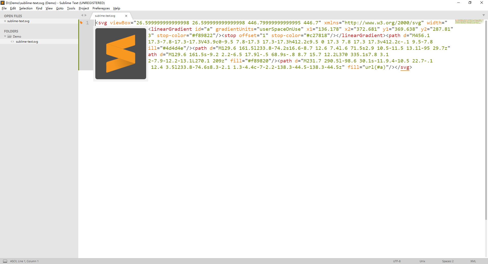

# Sublime SVG Preview 

> Sublime Text plugin to preview SVG files.

**Important tip: You must install [Inkscape](https://inkscape.org/) before you use this plugin, this plugin only works with Sublime Text 3.**



## Install

### Package Control

Recommand reach `Sublime SVG Preview` via [Package Control](https://packagecontrol.io/packages/SVG%20Preview).

### Manually

1. Locate your Sublime Text Packages directory by using Sublime Text menu `Preferences` -> `Browse Packages....`.
2. Cloning the repository directly into your Sublime Text Packages directory.
```bash
git clone https://github.com/chunqiuyiyu/sublime-svg-preview svg-Preview
```

## Usage

Just right-click and select `SVG Preview` in contextmenu when you view SVG file.

If you want to use hotkey, open menu `Preferences` -> `Key Bindings` and add key bindings like these:

```json
{
  "keys": ["ctrl+shift+v"],
  "command": "svg_preview"
}
``` 
## License

[MIT](./LICENSE)
